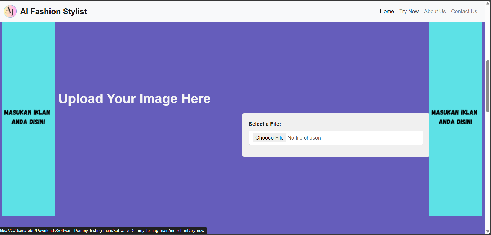
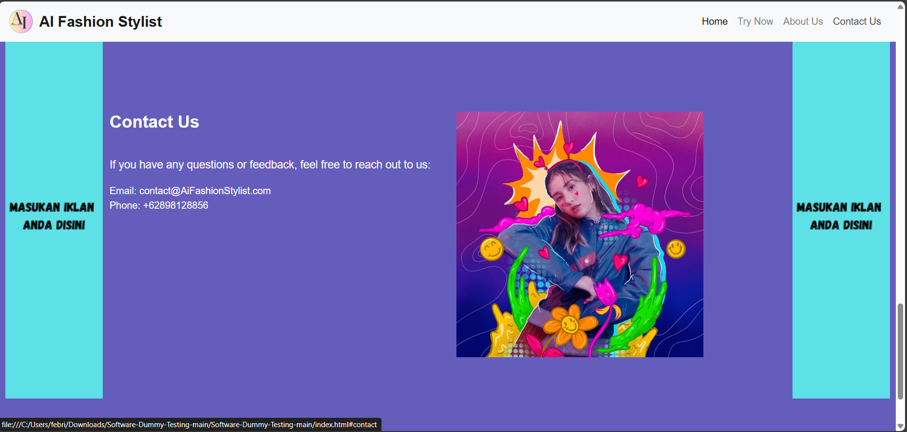

# AI FashionStylist (Still Dummy)
 <br />
Welcome to AI FashionStylist! This website helps you choose the perfect outfit based on your skin tone.

## Table of Contents
- [Introduction](#introduction)
- [Features](#features)
- [Getting Started](#getting-started)
- [Prerequisites](#prerequisites)
- [Installation](#installation)
- [Usage](#usage)
- [Screenshot](#screenshot)
- [Contact Us](#contact-us)
  

## Introduction
AI FashionStylist is a web application designed to assist users in selecting outfits that best complement their skin tone. By leveraging AI technology, it provides personalized fashion recommendations.

## Features
- *Home*: Overview of the website and its purpose.
- *Try Now*: Interactive section where users can get outfit recommendations based on their skin tone.
- *About Us*: Information about the team and the mission behind AI FashionStylist.
- *Contact Us*: Details on how to get in touch with the team.

## Getting Started
To get a local copy up and running follow these simple steps.

## Prerequisites
- A web browser (e.g., Chrome, Firefox, Safari)

## Installation
1. Clone the repo
   ```sh
   git clone https://github.com/FebriKun205/Software-Dummy-Testing.git

## Usage
The goal of AI Fashion Stylist in the Fashion Industry is to bring about a major transformation in the fashion industry, with the main goal of improving efficiency, personalization, and sustainability.


## ScreenShot





## Contact Us
Email: contact@AiFashionStylist.com <br />
Phone: +62898128856
